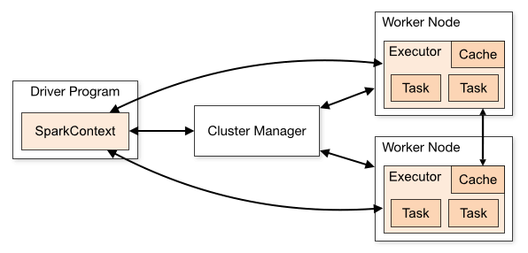

**Part 2: Spark Pool Architecture (Head Node vs. Worker Nodes)**

---

### Core Concept

A **Spark pool** is a collection of virtual machines (nodes) configured to work together as a single compute unit. To achieve distributed processing, Spark divides the responsibilities between one master node and multiple subordinate worker nodes.

---

### Key Components

* **Head Node (Driver Node):**
* Runs the **Driver Program** (which hosts your `SparkSession` or `SparkContext`).
* Acts as the "brain" or coordinator of the cluster.
* Translates your code into an execution plan, breaks queries into small tasks, and schedules them across the cluster.
* Collects final results or summary metrics from workers to display back to you.

* **Worker Nodes:**
* The computational workhorses of the pool.
* Run **Executor processes** in individual containers/virtual machines.
* Store cached data in memory and execute actual data transformations and actions (e.g., filtering, joining, or aggregating rows).

* **Storage Connection:**
* The cluster connects directly to compatible cloud storage—such as **OneLake** in Microsoft Fabric—allowing worker nodes to read and write Parquet or Delta files concurrently without bottlenecking the driver node.

---